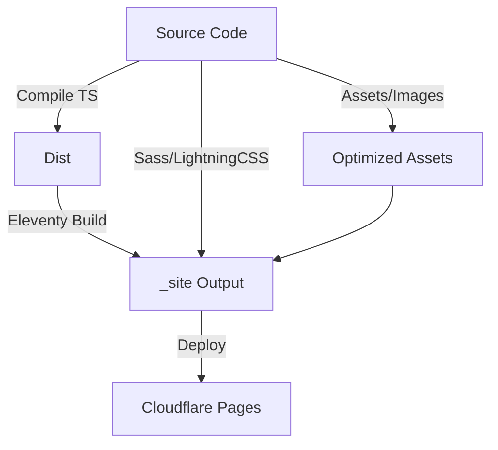

# 🏗️ System Architecture

This document describes the high-level architecture, design decisions, and technical constraints of
the project.

## 🎯 Architectural Goals

1.  **Performance First:** Zero-compromise performance (Lighthouse 100/100).
2.  **Strict Type Safety:** 100% TypeScript with strict mode enabled.
3.  **AMP Compliance:** Valid AMP HTML for instant loading.
4.  **Zero Maintenance:** Automated dependency updates and dead code analysis.
5.  **Accessibility:** WCAG 2.1 AA compliance enforced via CI.

---

## 🧩 System Overview

### High-Level Components



### Core Technologies

| Component    | Technology                     | Reasoning                                                                 |
| ------------ | ------------------------------ | ------------------------------------------------------------------------- |
| **SSG**      | Eleventy v3                    | Fastest build times, flexible templating, zero client-side JS by default. |
| **Language** | TypeScript 5.x                 | Type safety, modern features, self-documenting code.                      |
| **Styling**  | SCSS + LightningCSS            | CSS variables, nesting, rust-based minification for speed.                |
| **HTML**     | AMP (Accelerated Mobile Pages) | Enforced performance constraints, instant loading from cache.             |
| **Linting**  | ESLint + Stylelint             | Strictest possible rules to prevent technical debt accumulation.          |
| **Testing**  | Vitest + Cypress               | Fast unit tests + reliable E2E integration tests.                         |

---

## 📂 Directory Structure Strategy

The project follows a **Fractal / Modular** structure where possible, but adheres to Eleventy's
conventions.

```
src/
├── config/          # Application configuration & constants
├── filters/         # Nunjucks filters (logic free presentation)
├── lib/             # Core business logic (framework agnostic)
├── pages/           # Content hierarchy matched to URL structure
├── scss/            # Design system implementation
├── shortcodes/      # Reusable UI components (AMP components)
└── transforms/      # Post-processing (Minification, CSS guarding)
```

### Key Decisions

1.  **Centralized Constants (`src/config/constants.ts`):**
    - **Decision:** All magic numbers, limits, and shared values must be in one place.
    - **Why:** Prevents "magic number" drift (e.g., CSS limit defined in two places) and enables
      global tuning.

2.  **TypeScript for Build Tools:**
    - **Decision:** All build scripts, filters, and transforms are written in TypeScript.
    - **Why:** Provides type safety for the build pipeline itself, reducing "build break" errors.

3.  **Split linting and building:**
    - **Decision:** Linting is a separate step, not integrated into the build process.
    - **Why:** Allows for faster dev iteration. CI enforces linting before merge.

---

## ⚡ Performance Architecture

### Image Optimization Pipeline

1.  **Source:** High-res original images in `src/images/` or external.
2.  **Processing:** `src/lib/imageOptimizer.ts` uses `11ty-img`.
3.  **Output:** Generates AVIF and WebP with fallback JPEG.
4.  **Markup:** `amp-img` shortcode generates responsive `srcset`.

### CSS Delivery Pipeline

1.  **Source:** SCSS files using CSS Custom Properties.
2.  **Compilation:** Sass compiles to CSS.
3.  **Optimization:** LightningCSS minifies and handles vendor prefixes.
4.  **Guarding:** `src/transforms/cssGuard.ts` ensures CSS < 75KB (AMP limit).
5.  **Inlining:** CSS is inlined into `<style amp-custom>` for singular HTTP request.

### HTML Processing

1.  **Generation:** Eleventy generates HTML from Nunjucks.
2.  **Transform:** `src/transforms/htmlMinify.ts` uses `html-minifier-terser`.
3.  **Validation:** AMP Validator checks output in CI.

---

## 🛡️ Quality Assurance Layers

### Level 1: Editor (Immediate)

- **VS Code Settings:** Format on save, ESLint integration.
- **TypeScript:** Real-time type checking.

### Level 2: Git Hooks (Pre-commit/push)

- **Husky + Lint-staged:** Lints only changed files.
- **Commitlint:** Enforces semantic commit messages.
- **Pre-push:** Runs full unit test suite.

### Level 3: CI/CD (Pull Request)

- **GitHub Actions:**
  - Full Lint (ESLint, Stylelint, Markdownlint).
  - Type Check.
  - Unit Tests (Vitest).
  - Build verification.

### Level 4: Nightly/Release

- **Deep Audit:**
  - E2E Tests (Cypress) on multiple browsers.
  - Lighthouse CI (Performance budget enforcement).
  - SonarCloud (Static analysis & code smells).
  - Knip (Dead code detection).

---

## 🔄 Deployment Architecture

### Cloudflare Pages

- **Hosting:** Static asset hosting on Edge network.
- **Headers:** Security headers enforced via `_headers` file.
- **Redirects:** Managed via `_redirects`.

### Docker (Optional/Testing)

- **Dockerfile:** Multi-stage build (Build -> Serve).
- **Nginx:** High-performance static serving for local preview/testing.

---

## ⚖️ Trade-offs & Constraints

### 1. AMP Restrictions

- **Constraint:** No custom client-side JavaScript allowed (except inside `amp-script`).
- **Trade-off:** Limits interactivity but guarantees performance.
- **Mitigation:** Use AMP components (`amp-sidebar`, `amp-carousel`) for UI patterns.

### 2. CSS Size Limit (75KB)

- **Constraint:** All inlined CSS must be < 75KB.
- **Trade-off:** Cannot use heavy CSS frameworks (Bootstrap/Tailwind default).
- **Mitigation:** Custom minimal design system using SCSS. `cssGuard` prevents build if limit
  exceeded.

### 3. Strict TypeScript

- **Constraint:** Higher initial development effort (typing everything).
- **Benefit:** drastically reduced runtime errors and refactoring cost.

---

## 🔮 Future Architecture

1.  **Eleventy v4 Migration:** Native ESM support and faster builds.
2.  **View Transitions:** Implement cross-page transitions once stable in browsers/AMP.
3.  **Partial Hydration:** Explore "Islands Architecture" if moving away from strict AMP in the
    future.

---

_Last updated: 2026-01-07_
