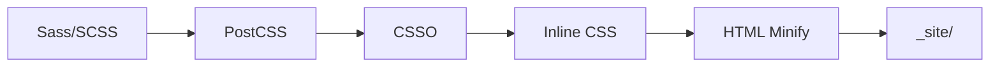

# Project Architecture

This document provides an overview of the project structure and architecture.

## Overview

This is a **Google AMP Portfolio** built with Eleventy 3.0+ static site generator. It implements a
"Zero-Defect" architecture with comprehensive testing, CI/CD, and code quality tooling.

## Directory Structure

```
├── .devcontainer/          # Dev Container configuration
├── .github/                # GitHub Actions workflows & templates
│   ├── actions/            # Reusable composite actions
│   ├── ISSUE_TEMPLATE/     # Issue templates
│   └── workflows/          # CI/CD workflows
├── .vscode/                # VS Code workspace settings
├── _includes/              # Nunjucks template partials
│   └── layouts/            # Base layouts
├── cypress/                # E2E tests (Cypress)
├── docs/                   # Project documentation
│   ├── ADR/                # Architecture Decision Records
│   └── development/        # Development guides
├── favicons/               # Favicon assets
├── fonts/                  # Self-hosted fonts
├── scripts/                # Build & utility scripts
├── src/                    # Source files
│   ├── _data/              # Eleventy global data
│   ├── filters/            # Nunjucks filters (TS)
│   ├── lib/                # Utility libraries
│   ├── pages/              # Page templates (Nunjucks)
│   ├── scss/               # Stylesheets (7-1 architecture)
│   │   ├── abstracts/      # Variables, mixins, functions, tokens
│   │   ├── base/           # Reset, typography, print
│   │   ├── components/     # UI components
│   │   └── utilities/      # Helper classes
│   ├── shortcodes/         # Nunjucks shortcodes (TS)
│   └── transforms/         # Eleventy transforms (TS)
├── test/                   # Unit tests (Vitest)
└── types/                  # TypeScript type definitions
```

## Build Pipeline



1. **Sass → PostCSS**: Compile SCSS with autoprefixer
2. **CSSO**: Aggressive CSS minification
3. **Inline**: Inject into `<style amp-custom>`
4. **HTML Minify**: Extreme minification (production only)

## Key Technologies

| Category   | Technology                        |
| ---------- | --------------------------------- |
| SSG        | Eleventy 3.0+                     |
| Templating | Nunjucks                          |
| Styling    | Sass (7-1), CSS Custom Properties |
| Build      | TypeScript, PostCSS, CSSO         |
| Testing    | Vitest (unit), Cypress (E2E)      |
| Linting    | ESLint, Stylelint, Prettier       |
| CI/CD      | GitHub Actions                    |
| Quality    | SonarCloud, Lighthouse CI         |

## AMP Compliance

This site is fully AMP-compliant:

- CSS is limited to 75KB (enforced by `cssGuard` transform)
- No external stylesheets (all CSS inlined)
- Self-hosted fonts (Font Awesome subset)
- AMP-specific components (`<amp-img>`, etc.)

## Testing Pyramid

```
           /\
          /  \  E2E (Cypress)
         /    \  - Smoke tests
        /------\  - Accessibility
       /        \  - Visual regression
      /  Unit    \
     /  (Vitest)  \  - Filters
    /              \  - Shortcodes
   /                \  - Transforms
  /------------------\
```

## CI/CD Workflow

1. **PR Validation**: Lint, typecheck, unit tests
2. **Main Branch**: Full build, E2E tests, SonarCloud scan
3. **Nightly**: Comprehensive quality audit
4. **Release**: Semantic versioning, changelog generation

## Related Documentation

- [Deployment Guide](./DEPLOYMENT.md)
- [Style Guide](./STYLE_GUIDE.md)
- [API Reference](./API.md)
- [Troubleshooting](./TROUBLESHOOTING.md)
